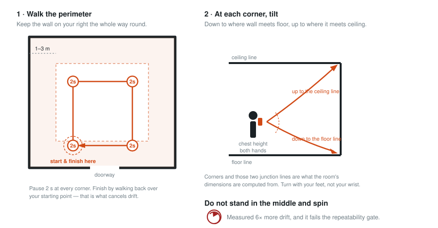
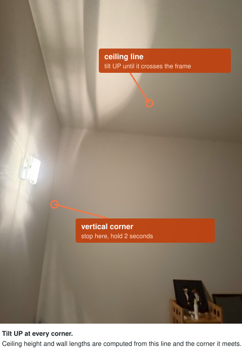
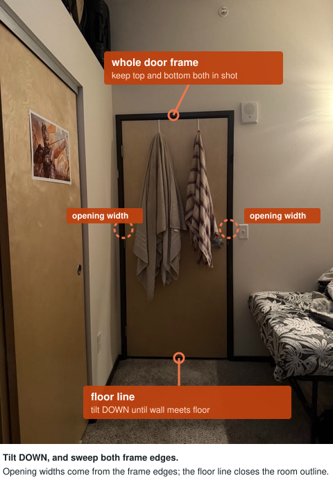

# Field Capture Protocol

**Route 2, stock capture tooling.** Polycam for the LiDAR tier, the native iOS
Camera for video and photos.

Written to be followed literally by someone who has never seen the pipeline.
Every distance, count and duration is stated, because anything left to
judgement is a capture we did not specify.

> **Status:** v0.2. Section 7 verified against a real export on 2026-08-28
> (iPhone 17 Pro, 236 keyframes), see
> [docs/capture-bakeoff.md](capture-bakeoff.md). Session timings in § 5 are now
> measured rather than estimated.

---

## 0. Before you enter the property, 3 minutes

1. Install **Polycam** from the App Store and open it. Create an account when prompted.
   - *Validated against Polycam **6.0.21** (profile icon → Check for Updates). Later versions may move menus; the file contract in § 7 is what matters.*
2. Tap the **profile icon** (bottom right) → **Settings** → **General** → turn **Developer Mode ON**.
   - *This cannot be applied afterwards. A scan taken with it off has no raw export and is unusable, the scan must be repeated.*
3. iOS **Settings → Photos → Transfer to Mac or PC → Keep Originals**.
   - *"Automatic" re-encodes photos and video during transfer.*
4. iOS **Settings → Camera → Formats → Most Compatible**.
5. Check free storage: **≥ 10 GB**. Wipe the lenses with a cloth or shirt.

## 1. Prepare the space, 2 minutes

1. Turn on **every light** including lamps and closet lights. Carry a lamp in from another room if one is short on light, a dim room is the most common cause of a bad capture, and it costs nothing to fix.
2. **Blinds depend on the tier:**
   - **Tier C (LiDAR): close them.** Bare glass is transparent to the depth sensor and blows out the exposure. Covered glass is a surface; bare glass is a hole in the scan.
   - **Tiers A and B (camera only): open them, and capture in daylight.** There is no depth sensor to confuse, and daylight is the largest free improvement available to a camera-only tier. Just never point the camera straight into a window.
3. Open every interior door fully, flat against the wall.
4. Clear the floor line where you can, remove bags, shoes, cables.
5. Move people and pets to a room you will scan last, or outside.

## 2. Pick your tier by the phone in your hand

| Tier | Hardware | Tool | Go to |
|---|---|---|---|
| **A · Photos** | Any iPhone 15 or newer | Native Camera | § 3 |
| **B · Video** | Any iPhone 15 or newer | Native Camera | § 4 |
| **C · LiDAR** | iPhone 15 Pro or newer | Polycam | § 5 |

## 3. Tier A, Photos, ~1 min per room

1. Open the **native Camera** app in Photo mode. No flash, no zoom, no portrait mode.
   - *Flash changes the lighting between shots, which stops the pipeline matching them to each other.*
2. Take **6 to 8** photos per room from **at least 3 different standing positions** do not stand in one spot and turn.
   - *Turning on the spot gives every photo the same viewpoint, and the pipeline recovers no shape from it. Stepping sideways between shots is what makes the room measurable.*
3. Stand in a corner and shoot the opposite corner. Repeat from two more corners. Each photo should overlap the last by roughly **two thirds**.
4. Include in at least one photo per room: the **full height** of one wall, floor line to ceiling line.
5. **Connector shots.** Stand in each doorway and take one photo into each of the two rooms it joins.
   - *This is the only evidence the pipeline has that two rooms touch. Skip it and the rooms cannot be assembled into a property.*
6. **Optional, strongly recommended.** Lay a sheet of A4 or US Letter paper flat on the floor, in view of at least 2 photos per room.
   - *Photos carry no sense of size. A page of known dimensions is what turns the reconstruction into inches. Without it the pipeline still runs, and reports a wider margin of error.*
7. Put each room's photos in a folder named in lower case with underscores: `kitchen`, `living_room`, `bedroom_1`, `hallway`.

## 4. Tier B, Video walkthrough, under 10 min per floor

1. **Camera → Video** set to **4K · 30 fps**. If the property is dim, use **1080p · 60 fps** instead.
   - *The faster frame rate trades resolution for less motion blur, and blur is what breaks tracking in low light.*
2. Hold the phone **vertically with both hands** at chest height, elbows in against your ribs.
3. Start recording at the main entrance, facing into the property. Say the room name out loud as you enter each one.
   - *The audio track gives us room boundaries in the video for free.*
4. Walk at **one step per second**. Count it. Roughly half normal walking speed.
5. Sweep each wall across about **3 seconds** and tilt slowly down to the floor line and up to the ceiling line on each one.
6. In every doorway, **stop and hold for 3 seconds** then turn to show both rooms before walking through.
7. Walk a continuous path through every room, then **return to the entrance where you started** before stopping.
   - *Ending where you began lets the pipeline close the loop and cancel accumulated error. Stopping at the far end of the property leaves that error uncorrected.*
8. One unbroken recording per floor. Do not pause, do not stop and restart.

## 5. Tier C, LiDAR, under 7 min per session



**What a correct corner looks like on your screen.** Both photographs are from
our own benchmark capture.

| | |
|---|---|
|  |  |


*Walk the perimeter with the wall on your right, pause 2 seconds at every
corner and tilt down to the floor line then up to the ceiling line, and finish
by walking back over where you started. Standing in the middle and turning on
the spot produced **6× more drift** in our own benchmark and failed the
repeatability gate, see [fix-loop.md](fix-loop.md).*


1. Open Polycam, swipe the bottom mode strip to **Space**. Confirm Developer Mode is still on.
2. Stand at the main entrance. Press the record button.
3. Stay **1 to 3 m (3 to 10 ft)** from the walls you are scanning. Closer than 1 m sees too little; past 3 m the depth reading degrades quickly.
4. Walk the **perimeter of each room** keeping the wall on your right throughout the property.
   - *One consistent direction makes every capture comparable to every other.*
5. **Stop at every corner for 2 seconds.** Tilt down to the floor line, then up to the ceiling line.
   - *Corners and those two junction lines are what the room's dimensions are computed from.*
6. In every doorway, stop and sweep the **frame edges** top and bottom.
7. **Return over your starting point** at the end of the session. Re-scanning ground you have already covered is wanted, not avoided.
   - *Revisiting a known place is what lets the app correct the drift built up along the walk.*
8. Keep each session to **under 7 minutes of scanning**. For anything larger, split into zones and make each new session **start in the last room of the previous one**.
   - *Measured at 95 keyframes per minute, so the 700-frame automatic pose-correction budget runs out at 7.3 minutes. Past that the correction stops and drift stays in the data. The overlap room is what joins the zones back together.*
9. Stop the capture and **let it finish processing**. Do not cancel, do not close the app.

## 6. Never

| | Instead |
|---|---|
| **Point straight at a mirror** | Approach at 30 to 45°. Keep it under a third of the frame. |
| **Scan a bare window** | Cover it first. If it cannot be covered, angle away and note the room. |
| **Stand square to a gloss or wet-look floor** | Approach at an angle and add half a metre of standoff. |
| **Use flash, or turn lights on and off mid-capture** | Lighting must not change during a session. |
| **Pivot or flick the wrist** | Turn with your feet, not your hands. |
| **Capture a moving person or pet** | Wait for them to leave the frame, then continue. |
| **Let anyone process, crop or edit the files** | No filters, no trimming, no in-app cleanup. |
| **Scan a room in the dark** | The depth sensor works; the camera does not, and tracking fails. |

## 7. Hand the files over, allow 30 minutes

1. **Tier C.** In Polycam open the capture → share → **Export → Raw**. AirDrop the ZIP. Send it exactly as exported, do not open, unzip or rename the contents.
   - **Allow 20 to 30 minutes, and do not leave the phone.** A 2.5-minute scan took roughly that long to process and package, and the app froze partway through. If it stops responding, force-quit and reopen Polycam, the export usually completed and the file is waiting in the capture's share menu. Keep the screen awake (Auto-Lock → Never), stay in the foreground, disable Low Power Mode, and keep the phone on a charger.
   - Expect roughly **15 MB per minute** of scanning.
2. **Tier B.** Connect by USB-C and import the clip with **Image Capture** or AirDrop it. Unedited, untrimmed.
3. **Tier A.** Import with Image Capture into the room folders, then zip the parent folder.
4. Name each delivery `<property>_<tier>_<YYYYMMDD>`, for example `12elmst_lidar_20260901`.
5. Raw export must be done **on the phone that captured it**. Do not wipe the app before the files are confirmed received.

**What a correct Tier C delivery contains** (verified 2026-08-28):

```
mesh_info.json · polycam.mp4 · thumbnail.jpg          ← archive root, no wrapper folder
keyframes/images/<timestamp>.jpg                      1024×768
keyframes/depth/<timestamp>.png                       256×192, 16-bit, millimetres
keyframes/confidence/<timestamp>.png                  256×192, levels 0 / 54 / 255
keyframes/cameras/<timestamp>.json                    raw pose + intrinsics + sensor metadata
keyframes/corrected_cameras/<timestamp>.json          loop-closed pose, use these
```

All five `keyframes/` folders must have the **same file count**. If
`corrected_cameras/` is missing or short, the session ran past the correction
budget, re-capture it as shorter zones.

---

## Device matrix

| Tier | Hardware | Tool | What reaches the pipeline | Scale | Wall length |
|---|---|---|---|---|---|
| **A · Photos** | iPhone 15 / 15 Plus and newer | Native Camera | 6 to 8 JPEG per room + connector shots. No depth, no poses. | inferred | *pending* |
| **B · Video** | iPhone 15 / 15 Plus and newer | Native Camera 4K30 | One continuous clip. Poses recovered by us, not supplied. | recovered | *pending* |
| **C · LiDAR** | iPhone 15 Pro / Pro Max and newer | Polycam Space, dev mode | 1024×768 RGB, 256×192 16-bit mm depth, confidence, intrinsics, loop-closed poses, per-frame IMU/exposure metadata. | metric | *pending* |

The accuracy columns stay marked *pending* until our own benchmark produces
them. Quoting a number we have not measured is the specific failure this
exercise is scored against.

---

## Verify before submission

Run against every capture before it is accepted:

```sh
python3 scripts/inspect_capture.py <exported>.zip
```

- [x] Export menu labelled **Raw** where § 7 says.
- [x] `corrected_cameras/` populated after a loop-back, 236/236 frames.
- [x] Depth is 16-bit single-channel PNG in millimetres, 256×192.
- [ ] Record the Polycam version number tested, and pin it in the submission.
- [ ] Time processing and export separately on the next run, § 7's 20 to 30 minute
      allowance is one observation, and we cannot yet say which stage was slow.
- [ ] Tier A and Tier B captures still outstanding.
- [ ] Hand this page to someone who has not seen the pipeline and watch them follow it without helping.

---

## Why the page says what it says

Every instruction above answers to a scored gate. These are the ones most
likely to be challenged at the defense.

**Three standing positions, not one.** Photographs taken by turning on the spot
share a single viewpoint and yield no parallax, so no geometry can be recovered
from them however many you take. Stepping between shots is the difference
between a photo set that measures and one that does not.

**Loop-backs required, not forbidden.** Returning over known ground is what
supplies the constraint that cancels accumulated drift. A protocol that forbids
revisits removes the evidence the drift gate asks us to act on.

**Sessions capped at 6 to 8 minutes with an overlap room.** Automatic pose
optimisation stops running past roughly 700 frames. Shorter sessions keep every
zone inside that budget, and starting each new session in the previous zone's
last room gives us the shared geometry to join them.

**Blinds closed, lights on.** The two failure modes pull in opposite
directions: bare glass is transparent to the depth sensor and blows out the
exposure, while a dark room defeats visual tracking. Covering the glass and
lighting the room satisfies both.

**A sheet of paper on the floor.** The photo tier has no metric scale of its
own. A known-size object recovers it directly. It is optional because the
brief's floor is that any photo set produces a result, so the pipeline falls
back to learned depth and standard-fixture priors, and widens its stated
interval to match. The interval reports which route was taken.

**Room names spoken aloud on video.** It costs the operator nothing and hands
us room boundaries in a single continuous clip that otherwise has none.
