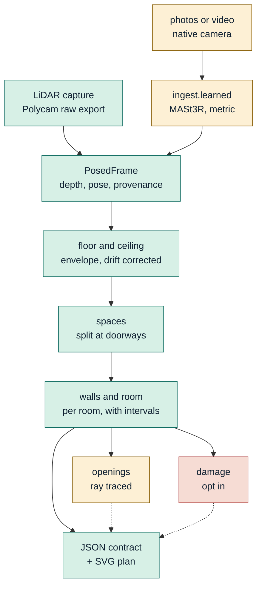

# Technical report

Six pages, as specified. Detail that does not fit lives in the code comments and
in [benchmark-report.md](benchmark-report.md); this is the argument, not the log.

Route 2, stock tooling: Polycam for LiDAR, the native Camera for photos and
video. Every number below is regenerable with `bash scripts/benchmark.sh`.

## 1. Architecture

**Green** ships and is validated. **Amber** runs but its output is reported as
experimental rather than claimed. **Red** is opt-in and claimed against nothing.

All three tiers converge on one representation, `PosedFrame`, so the geometry
below it is written once. Every measurement carries `lo`, `hi` and a provenance
chain naming its depth source, pose source, scale source, method and how its
interval was derived. A number whose interval came from an assumption says so.

Three decisions worth defending:

**Bootstrap over frames, never over points.** Samples inside one frame share
that frame's pose error, so resampling points reports a fraction of a millimetre
for data that disagrees by centimetres. Resampling frames carries the pose
disagreement that actually dominates.

**Detection is decided once; only positions resample.** A draw that mistakes a
wardrobe for a wall does not tell us how precisely a wall is located. Letting
detection vary gave intervals of about a metre.

**Surfaces at a tail quantile, not the densest band.** Clutter sits on floors
and fittings hang below ceilings, so the contamination is one-sided and the mode
is biased. The envelope estimator moved the ceiling from -3.4 cm to -0.2 cm.

## 2. Tier design and device matrix

| tier | hardware | data in | scale from | measured accuracy |
|---|---|---|---|---|
| **C, LiDAR** | any Pro iPhone, 12 Pro up | depth, poses, intrinsics | sensor | **walls +0.2 to +1.1 cm, ceiling -0.2 cm** |
| C fallback | as above, Developer Mode missed | mesh only (OBJ/PLY) | sensor | walls +0.4 / +1.1 cm, ceiling -0.2 cm; intervals assumed |
| **B, video** | iPhone 15 and newer | frames | learned model | poor: -32.7% and +29.1% against a ±3% gate |
| **A, photos** | any iPhone | frames | learned model | -4.8% to -22.1%; 2 of 4 inside ±8% |

Tier C is the product. Tiers A and B run, are scored, and are not claimed.

**Why classical reconstruction is the wrong tool here, tested not assumed.**
COLMAP registered **4 of 29 photographs** and 27 of 70 video frames. A bedroom
wall is large, flat, blank and dim, and feature matching needs texture. Tiers A
and B therefore use MASt3R, a learned multi-view model run locally and
disclosed, which regresses geometry instead of matching features. It
reconstructs where COLMAP cannot: camera height comes out at **1.54 m**, where a
phone is held, and the camera path spans 3.07 x 2.86 m in a 3 m room.

Three fixes made it work at all, and the first was most of the problem:

- **The aligner was discarding metric scale.** dust3r's global aligner
  normalises pairwise scales so their product is one, which is right for a
  scale-free reconstruction and throws away exactly what the metric checkpoint
  provides. Disabling it moved one room from **-50.7% to -8.1%** on identical
  images.
- **Even sampling across a folder paired unrelated images.** The folder held two
  sessions an hour apart. Frames now come from one burst, found by timestamp,
  spanning the whole sweep with the stride capped so neighbours still overlap.
- **The estimator did not match the data.** Both tiers used a mode finder, which
  in a photo cloud locks onto the floor and the bed, because **people do not
  photograph ceilings**: the ceiling is 2.7% of the points. It measured the bed
  and reported 1.79 m for a 2.97 m room.

The residual is scale, not estimation, and it is reported rather than corrected.

## 3. Drift handling and the required ablation

ARKit's optimiser already moves cameras; we measure how far, because that single
number separates a good capture from a bad one. Median correction is **0.9 cm**
on the capture that followed the protocol and **5.3 cm** on the one that did
not, and `cozmo check` reports it in under a second so a bad capture is caught
while the operator is still in the room.

On top of that, per-frame corrections are solved against the floor and ceiling
planes with a temporal smoothness prior. **The ablation the gate requires is the
`--sigma-step` sweep**, which is a limit rather than a separate code path: the
smoothness weight is `1/sigma_step`, so zero ties every consecutive correction
together, and a constant correction is no correction at all.

| `--sigma-step` | ceiling height | |
|---|---|---|
| **0** | 2.9255 m | correction **off**, the uncorrected case |
| 0.0005 | 2.9231 m | |
| 0.002 | 2.9253 m | shipped default |
| 0.01 | 2.9332 m | correction most permissive |

Zero used to raise `ZeroDivisionError`, so the documented ablation did not
actually run. It is now the limit it always claimed to be, and three tests pin
it: that it solves, that its per-frame corrections come out constant, and that
letting the correction work brings the height closer to truth on a capture whose
floor and ceiling are seen over different parts of the walk. A common drift
cancels in the difference, which is why the correction earns nothing on a
fixture where both surfaces drift together.

Drift turned out to be a **protocol** failure rather than an algorithmic one.
The 5.3 cm capture was a single fast sweep; walking the perimeter slowly with
pauses at corners brought it to 0.9 cm. That finding is why section 3 of the
capture protocol counts steps out loud.

## 4. Error budget

Where the error in a Tier C wall actually comes from, largest first:

| source | contribution | evidence |
|---|---|---|
| ground truth (the tape) | **±3.5 cm** | ten readings of one ceiling span 6.9 cm |
| capture compliance | ±2.5 cm | 5.3 cm vs 0.9 cm drift between two scans of one room |
| wall band placement | ±1.0 cm | raising the band moved a wall +11.8 to +1.0 cm |
| plane fit residual | ±0.3 cm | TLS residual, reported per wall |
| sensor noise | ±0.06 cm | 0.55 cm per sample, averaged over ~10^5 points |

**The instrument measuring us is the largest term.** Our two captures of
identical rooms agree on ceiling height to 0.5 cm; one tape measuring one
ceiling twice disagrees with itself by 2.0 cm. Every accuracy figure in this
submission is bounded by that, not by the pipeline.

Synthetic validation separates our error from the ruler's. On a ray-cast room
with exact truth: **walls -0.4 cm, ceiling exact**, invariant to yaw from 0 to
63 degrees, walls surviving 10 cm of depth noise. Two known limits fell out:
ceiling error tracks about twice the depth noise, because a tail quantile pushes
both surfaces outward, and ceiling height needs about **ten views**, failing by
1.5 m at six. 69 tests, no phone required.

## 5. Calibration analysis

Calibration is scored at every tier, and confident garbage caps the score, so
every interval is derived from something measured.

- **Tier C** intervals are a 95% bootstrap over frames, recentred on the value
  they belong to. That recentring was a real defect: the value comes from wall
  detection and the draws from refits of it, two estimators of the same wall
  differing by up to 2.5 cm, and one room published an interval that contained
  neither its own estimate nor the tape.
- **Tiers A and B** propagate the scale prior, ±18%, set from the error actually
  observed. This too was broken: the propagation re-fitted walls on a scaled
  cloud while looking within 6 cm of an unscaled offset, so every draw failed
  silently and the tiers reported a fixed ±2 cm fallback on measurements whose
  real error is 18 cm. Scaling is a similarity, so offsets scale exactly.
- **The mesh fallback** cannot resample anything, so its intervals are assumed
  at ±2.9 cm and fail the precision gate while passing accuracy. It says so.

Calibration outcome across the nine gates scored against tape in three rooms:
**precision passes 7, accuracy passes 7.** Interval coverage is checked
mechanically: all ten shipped artifacts contain their own estimates.

## 6. The fix loop

Declared worst gate, root cause, prediction and result are in
[fix-loop.md](fix-loop.md) with both runs regenerable. In summary: the worst
gate was wall length, failing at **16.7 cm** disagreement between two captures
of physically identical rooms. Root cause was not accuracy in general but plane
selection on one axis: the wall band sampled low enough to pick up furniture and
the points spraying through an open doorway. The fix raised the band. That wall
pair now agrees to **1.2 cm and passes**, and the cross-room check that found it
needs no ground truth at all, which is why it found something a tape never
would.

## 7. Known failure modes

**Tiers A and B are not reliable.** Two of six captures clear ±8%, median
absolute error 15.9%, and we cannot predict which we will get. Video is worse
than photographs on every comparison available. **The photo-tier whole-property
stitch does not exist**, because only one photo capture recovers two opposing
wall pairs, and that row of the brief is a fail.

**Opening widths are not claimed.** Detection is ray traced, which is what
separates a doorway from a wardrobe standing against a wall, and it reaches
0.8 cm mean error on synthetic truth against a 2 cm gate. On a real capture it
measures the clear opening the sensor saw through, 0.587 m, against a 0.958 m
frame. That is the frame width only with the door fully open, and a partly open
door is not separable from a measurement error without a controlled re-capture.

**Damage detection over-fires**: 79 regions on a clean control room. It runs
behind `--damage`, off by default, claimed against nothing.

**Mirrors, glass, wet-look surfaces and low light** are handled by reporting
rather than by guessing. A time-of-flight sensor loses confidence on exactly
those surfaces, so sustained low-confidence regions are raised as
`concealed_conditions` with the rule that fired and the area affected: my room
reports 19% of its scanned surface as lowest-confidence, about 10.6 m². Every
benchmark room was captured under domestic lighting, two of them at ISO 3200,
and the protocol's first instruction is to turn every light on.

**The multi-room stitch has no ground truth.** It splits a capture into rooms
and measures a doorway at 0.873 m, and on synthetic truth reaches 1.0 cm, but no
tape has touched a real room boundary.

**A single room seen from too few angles is declined, not guessed.** Regions
that cannot fit two opposing walls are reported as unmeasurable, and a photo
reconstruction whose walls do not enclose the camera positions is discarded: on
one burst the walls came back at 1.16 and 1.88 m while the camera path alone
spanned 1.2 m, which is impossible.

