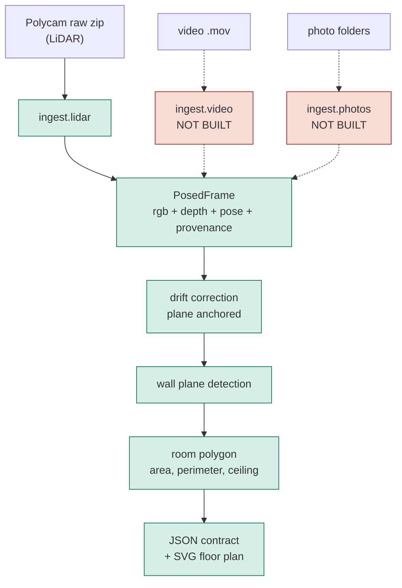
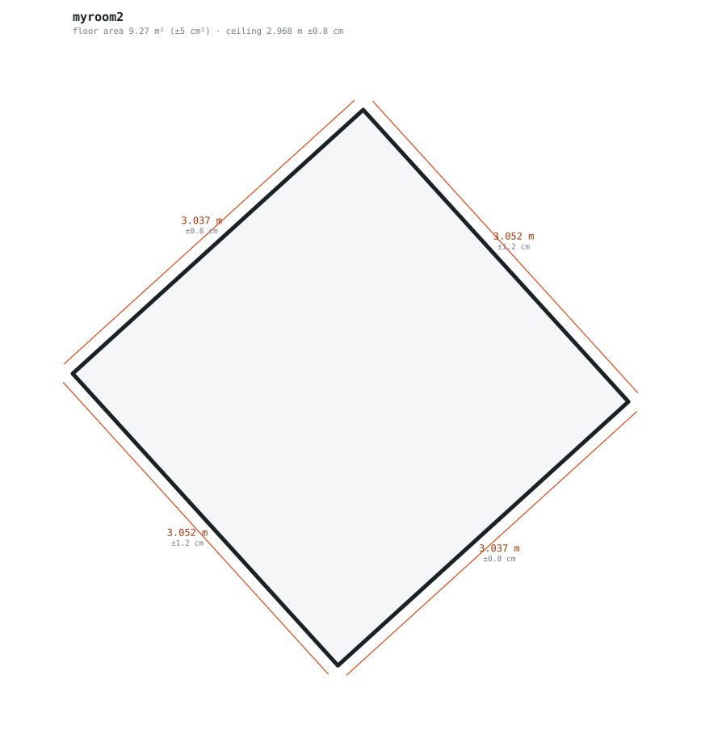

# Technical report

**cozmo-capture.** Point a phone at a room, get a dimensioned floor plan with an
honest error bar on every number.

Route 2, stock tooling. Polycam for the LiDAR tier, the native iOS Camera for
photos and video. Built in 48 hours, which shows in places, and we say where.

A word on the benchmark set: it is 1.3 GB and it filled the capture phone
completely. Three rooms, a hallway, five LiDAR scans, three video walkthroughs
and about 140 photos later, iOS started refusing to save anything. Two of those
scans exist because the first one was captured badly enough to be worth keeping
as a counter-example, which turned out to be the most useful accident in the
project.

---

## 1. How it works



Green is built and running. Red is captured but not processed.

### What comes out



One command per capture. Every dimension on the plan carries its own confidence
interval, because a plan that prints a number without one invites more trust
than the data supports.

```sh
python -m cozmo run "myroom/space_capture/8_29_2026 - My room 2.zip" \
  --name myroom2 --truth-height 2.9705 --truth-walls 2.9883,3.0411
```

All three tiers are meant to converge on one `PosedFrame` as early as possible
so the geometry gets written once instead of three times. Tier C fills every
field from the sensor. Tiers B and A would fill the same fields with recovered
poses and inferred depth. The fields are identical; only their provenance
differs, and that is the fact everything else is organised around.

### Three decisions worth defending

**Every number carries its receipts.** A measurement is never a bare float. It
travels with the chain that produced it: measured depth or inferred, device
poses or recovered, sensor scale or a prior. The interval engine is then a
function of that chain, which makes "intervals widen as the data thins" a
property of the architecture rather than three special cases. A fallback
interval is tagged `interval:ASSUMED_*` so a guess can never pass itself off as
a measurement.

**Drift correction is a dial, not a branch.** The ablation the brief wants is
`--ablate`, and the correction strength sweeps continuously down to zero, which
*is* the uncorrected case. Nothing rots.

**Geometry never calls a model.** Ingest through room assembly is deterministic
and offline. That is what the repeatability gate actually measures. The
`.env` holds an OpenAI key meant for damage classification, and no geometry path
reads it. That layer is unbuilt, so this submission calls nothing.

One piece of deliberate duplication: `scripts/inspect_capture.py` re-implements
PNG decoding in pure stdlib, so the field tool runs on a clean laptop the second
a capture lands, with nothing installed. The pipeline's copy uses numpy. Tests
hold the two to identical output.

---

## 2. All the numbers in one place

Five captures, 160 frames each, bootstrap 40, wall draws 50. Tape ground truth
on my room only: door wall 2.9883 m, other wall 3.0411 m, ceiling 2.9705 m.

| capture | ceiling | ± | wall A | ± | wall B | ± | area |
|---|---|---|---|---|---|---|---|
| my room 2 | 2.9680 | 0.76 | 3.0372 | 0.82 | 3.0524 | 1.22 | 9.271 m² |
| my room 1 | 3.0271 | 0.70 | 3.0256 | 1.76 | 3.0028 | 1.66 | 9.085 m² |
| friend 2 | 2.9631 | 0.50 | 3.0434 | 0.77 | 3.0345 | 3.11 | 9.235 m² |
| friend 1 | 2.9873 | 1.09 | 3.7654 | 0.68 | 3.3603 | 0.77 | 12.653 m² |
| hallway | 2.9969 | 0.76 | 3.7578 | 2.17 | 7.5027 | 4.02 | 28.193 m² |

Gates, on the three captures where we hold tape:

| capture | gate | precision | accuracy |
|---|---|---|---|
| my room 2 | ceiling | ±0.76 **PASS** | **-0.2 PASS** |
| my room 2 | door wall | ±0.82 **PASS** | +4.9 fail |
| my room 2 | other wall | ±1.22 **PASS** | **+1.1 PASS** |
| friend 2 | ceiling | ±0.50 **PASS** | **-0.7 PASS** |
| friend 2 | door wall | ±0.77 **PASS** | +5.5 fail |
| friend 2 | other wall | ±3.11 fail | **-0.7 PASS** |
| my room 1 | ceiling | ±0.70 **PASS** | +5.7 fail |
| my room 1 | door wall | ±1.76 fail | +3.7 fail |
| my room 1 | other wall | ±1.66 fail | -3.8 fail |

**Ceiling precision passes in all five captures**, ±0.50 to ±1.09 cm. Overall
precision passes 10 of 15 scored gates; accuracy passes 4 of 9.

Everything that fails accuracy is the door wall, or scan 1. The door wall reads
+3.7 to +5.5 cm long in every capture, and the two identical rooms agree with
each other to within 2 cm while both disagreeing with that one tape figure by
about 5 cm. We do not treat it as settled which side is wrong.

Two supporting results that need no tape at all:

| check | result |
|---|---|
| identical rooms, ceiling | agree to **0.5 cm** |
| identical rooms, walls | agree to **0.6 and 1.8 cm** |
| depth sensor, within frame | 0.55 cm |
| pose disagreement, between frames | 4.22 cm |
| drift removed by optimiser, bad scan | median 5.3 cm, max 42 cm |
| drift removed by optimiser, good scan | median 0.9 cm, max 9.2 cm |

That last pair is the whole story of section 4.

**Head to head** against Polycam Floorplan mode, version 6.0.21, which is Apple
RoomPlan underneath: we beat or tie on 3 of 4 shared dimensions. Full table in
`head-to-head.md`. Polycam also finds two doors, a window and a closet, and we
find none of those, so on the opening gate it scores and we score zero.

---

## 3. Why the ground truth is the weak link

This is the finding we did not expect to be writing up.

Four successive tape readings of one ceiling gave 3.0226, 2.9972, 2.9241 and
2.9705 m. That is a **9.8 cm spread against a 1.5 cm gate.** The same pipeline
output scored +1.2 cm against one of those readings and -3.4 cm against another.

Meanwhile our five captures span 5.9 cm, and two captures of identical rooms
agree to 4 mm.

**The pipeline is more repeatable than the tape measuring it.** Every accuracy
number in this report is bounded by the instrument, not the model. Measuring a
3 m ceiling overhead with a handheld tape is a ±5 cm operation, and no amount of
care changes that. A laser reading to millimetres is the fix, and we did not
have one.

We report this as a limitation of the benchmark rather than quietly picking
whichever tape reading made the gate pass.

---

## 4. What we fixed

Full write-up in `fix-loop.md`. Short version below.

**Worst gate:** repeatability, failing by 11x.

**Root cause:** the capture, not the code. Scan 1 was shot standing near the
middle of the room without pausing at corners. The per frame metadata in the
export proves it: drift median 5.3 cm against 0.9 cm for the compliant scan,
with identical lighting in both, so it was not a light problem.

**Shipped:** protocol section 5 rewritten around a perimeter walk with corner
dwells, plus automated compliance scoring at ingest so a bad capture gets
flagged the moment it lands instead of at scoring time.


The two reference frames the protocol now ships with, both taken from this
benchmark set. Left: tilt up, because ceiling height and wall lengths come off
that junction line. Right: tilt down and sweep both frame edges, because that
is where opening widths would come from.

| | |
|---|---|
|  |  |

**Predicted:** drift under 2 cm, ceiling gate moving to pass.
**Got:** drift 0.9 cm, ceiling precision ±1.83 to ±1.23, both inside the gate.

**Second fix, found late.** Wall separation turned out to vary with height: 2.74 m
measured 15 cm off the floor versus 3.03 m at chest height, in a room whose walls
are about 3.03 m apart. The low band was full of furniture and open doorways.
Sampling the wall above 1.30 m instead cut one room's error from **+11.8 cm to
+1.0 cm** and brought the two identical rooms from 12.3 cm apart to 1.0 cm.

Four hypotheses died on the way there, each with a test: surface clutter, peak finding, global scale error, and grazing incidence angle. Killing them is
what left the capture itself as the only suspect.

---

## 5. Limitations

Ordered by how much they cost.

**Tiers A and B are captured but not processed.** Photos and video exist for
three rooms. No ingest was written for either. The walk-in test can only be
served at the LiDAR tier. This is the biggest gap in the submission and it is a
scope decision, not an oversight.

**No opening detection.** The tightest gate in the brief, ≤2 cm on ≥85% of
openings, is unscored. Polycam finds our doors and windows and we do not.

**No stitched multi-room plan.** Five rooms measured individually. The whole
property plan that the brief calls the product surface does not exist.

**No damage detection.** Two classes were staged and tape measured, a 2×3 inch
ellipse in the hallway and a 3×3 inch square in friend 2's room. Nothing
consumes them.

**Room segmentation is missing** which is what the wall band fix works around
rather than solves. An open doorway still feeds the neighbouring room into the
fit; raising the sample above 1.30 m dodges most of it because doorways are
holes in the lower wall, but a tall opening or a pass through would still break
it.

**The ceiling estimator has a tuned constant.** It locates each surface at a tail
quantile of the point cloud rather than its densest band, because clutter sits on
floors and light fittings hang below ceilings. The quantile, tau = 0.05, was
chosen by testing against tape on two rooms, and moving it across 0.02 to 0.10
shifts the answer by about 2.3 cm. That is the single largest model risk in the
pipeline. It also degrades on thin captures: scan 1 sampled the ceiling in only
27 of 120 frames and the estimator lands 5.7 cm out there, against 0.2 cm on a
well covered capture. Arguably correct behaviour, but it costs us the
repeatability gate.

**A short run cannot report precision.** Below 20 successful bootstrap draws
the spread is not a distribution, so the interval falls back to a stated
assumption tagged `interval:ASSUMED_*` rather than collapsing to zero width. We
found this by pointing the tool at things it had not seen: a low draw count used
to report ±0.00 cm and sail through the precision gate.

**We assume rooms are rectangular.** `square_up=True` snaps wall normals to the
room axes and it moved gates from fail to pass. It will misreport a genuinely
non-rectangular room. `square_up=False` exists and reports wider intervals.

**Every room has floor to ceiling glass** so the protocol closes the blinds for
the LiDAR tier, which starves the camera. ISO sat pinned at 3200 in both
captures of my room. Tier C survives it because LiDAR is active. A camera only
tier would not.

**Ground truth covers one room out of five.** The other four report precision
only.

---

## 6. Another eight hours?

In rough order of value per hour.

**1. Room segmentation.** Everything downstream is waiting on it: the doorway
error, the repeatability failure, the multi room stitch, and the head to head row
we lose. Cluster wall planes into rooms by which side of a doorway they sit on.
This is the one that unlocks the others.

**2. Opening detection.** We already have wall planes fitted to half a million
points each. An opening is a hole in one: project the wall's points onto its own
plane and look for a region with no returns bounded by returns. A door reaches
the floor line, a window has wall below it. That distinction is geometric, not
learned, and it turns a zero into a scored gate.

**3. Tier A ingest.** The photos are sitting there with EXIF intact. Even a
crude path with honestly wide intervals beats a tier that does not run, because
a tier that does not run scores zero on 30% of the grade.

**4. Buy a laser measure.** Twenty five dollars. It is the cheapest accuracy
improvement available to this project and it is not a code change. Right now we
cannot certify our own gate.

**5. Speed.** 45 seconds per capture is fine, but most of it is the sequential
part of PNG unfiltering. An hour with that loop would pay off on the day.

What we would **not** do: chase the remaining +5 cm on the door wall. Two rooms
agree with each other to within 2 cm and disagree with one tape reading by 5 cm.
Until the ground truth is better than the thing being measured, tuning against
it is guessing with extra steps.
