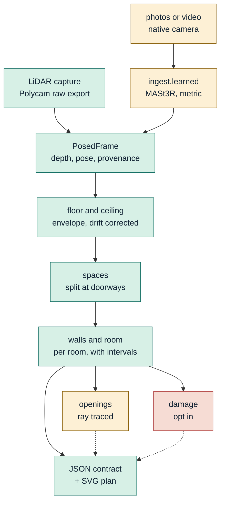

# Technical report

Three pages. The cap is six and the brief says length trades against
engineering, so this is the argument only; the numbers behind it are in
[benchmark-report.md](benchmark-report.md), regenerable with
`bash scripts/benchmark.sh`.

Route 2, stock tooling: Polycam for LiDAR, the native Camera for photos and video.

## 1. Architecture

**Green** ships. **Amber** runs but is reported as experimental. **Red** is
opt-in and claimed against nothing.

All three tiers converge on `PosedFrame`, so the geometry below it is written
once. The order matters: **surfaces first**, because everything needs to know
which way is down; **spaces second**, before any wall is fitted, or a two room
capture fits one rectangle across both; **walls last, per room**, so a surface
next door can never be a candidate for this one. Openings and damage hang off
the finished room and cannot move a dimension.

Every measurement carries `lo`, `hi` and a provenance chain naming its depth,
pose and scale sources, its method, and how its interval was derived. An
interval that came from an assumption rather than a resample says so.

Three decisions worth defending. **Bootstrap over frames, never over points**:
samples in one frame share that frame's pose error, so resampling points reports
a fraction of a millimetre for data disagreeing by centimetres. **Detection
decided once, positions resampled**: a draw mistaking a wardrobe for a wall says
nothing about where a wall is, and letting detection vary gave intervals of a
metre. **Surfaces at a tail quantile, not the densest band**: clutter sits on
floors and fittings hang below ceilings, so contamination is one-sided; this
moved the ceiling from -3.4 cm to -0.2 cm.

## 2. Tier design and device matrix

| tier | hardware | data in | scale | measured accuracy |
|---|---|---|---|---|
| **C, LiDAR** | any Pro iPhone | depth, poses, intrinsics | sensor | **walls +0.2 to +1.1 cm, ceiling -0.2 cm** |
| C fallback | Developer Mode missed | mesh only | sensor | walls +0.4 / +1.1 cm; intervals assumed |
| **B, video** | iPhone 15+ | frames | learned | -32.7% and +29.1% against ±3% |
| **A, photos** | any iPhone | frames | learned | -4.8% to -22.1%; 2 of 4 inside ±8% |

Tier C is the product. A and B run, are scored, and are not claimed.

Classical reconstruction was tested, not assumed: **COLMAP registered 4
photographs of 29**. A bedroom wall is flat, blank and dim, and matching needs
texture. So A and B use MASt3R, a learned model run locally and disclosed. Three
fixes made it work, and the first was most of it:

- **The aligner discarded metric scale.** dust3r normalises pairwise scales so
  their product is one, which throws away what the metric checkpoint provides.
  Off: **-50.7%**. On: **-8.1%**.
- **Even sampling paired unrelated images.** The folder held two sessions an
  hour apart. Frames now come from one burst, spanning the sweep, stride capped.
- **The estimator did not match the data.** A mode finder locks onto the floor
  and the bed, because **people do not photograph ceilings**: the ceiling is
  2.7% of the points. It reported 1.79 m for a 2.97 m room.

Two independent sanity checks pass: camera height comes out at **1.54 m**, and
the top 1% of points span **4.6 cm**, a ceiling plane rather than noise.

## 3. Drift handling and the ablation

Median pose correction is **0.9 and 1.1 cm** on the two compliant captures and
**5.3 cm** on the non-compliant one. `cozmo check` reports it in under a second,
so a bad capture is caught while the operator is still in the room. Drift was a
protocol failure, not an algorithmic one.

Per-frame corrections are then solved against the floor and ceiling planes with
a temporal smoothness prior. The ablation is the `--sigma-step` sweep: the
weight is `1/sigma_step`, so zero ties every correction together, and a constant
correction is none.

| `--sigma-step` | ceiling | |
|---|---|---|
| **0** | 2.9255 m | correction **off** |
| 0.002 | 2.9253 m | shipped default |
| 0.01 | 2.9332 m | most permissive |

Zero used to raise `ZeroDivisionError`, so the documented ablation never ran.
Three tests now pin it.

## 4. Error budget

| source | contribution | evidence |
|---|---|---|
| ground truth (the tape) | **±3.5 cm** | ten readings of one ceiling span 6.9 cm |
| capture compliance | ±2.5 cm | 5.3 vs 0.9 cm drift between two scans |
| wall band placement | ±1.0 cm | raising the band moved a wall +11.8 to +1.0 cm |
| plane fit residual | ±0.3 cm | TLS residual, reported per wall |
| sensor noise | ±0.06 cm | 0.55 cm per sample over ~10^5 points |

**The instrument measuring us is the largest term.** Two compliant captures of
one room agree on walls to **0.07 cm**; one tape measuring one ceiling twice
disagrees with itself by 2.0 cm.

Synthetic ray-cast rooms separate our error from the ruler's: **walls -0.4 cm,
ceiling exact**, invariant to yaw 0 to 63 degrees, walls surviving 10 cm of
depth noise. Two limits fell out: ceiling error tracks about twice the depth
noise, and ceiling height needs about **ten views**, failing by 1.5 m at six.
72 tests, no phone required.

## 5. Calibration analysis

Calibration is scored at every tier and confident garbage caps the score, so
every interval derives from something measured.

**Tier C** is a 95% bootstrap over frames, recentred on the value it belongs to.
That recentring fixed a real defect: value from detection, draws from refits,
differing by up to 2.5 cm, and one room published an interval containing neither
its estimate nor the tape. **Tiers A and B** propagate a ±18% scale prior set
from observed error; this was also broken, re-fitting walls on a scaled cloud
while matching within 6 cm of an unscaled offset, so every draw failed silently
and the tiers reported ±2 cm on measurements whose real error is 18 cm. **The
mesh fallback** cannot resample, so its ±2.9 cm intervals are assumed and fail
precision while passing accuracy.

Outcome across twelve gates scored against tape: **precision 10, accuracy 9**.
All eleven shipped artifacts contain their own estimates, checked mechanically.

## 6. The fix loop

Declared worst gate: repeatability, wall pair B, **16.7 cm** between two captures
of physically identical rooms. Root cause was plane selection, not accuracy: the
wall band sampled low enough to catch furniture and points through an open
doorway. Shipped as a raised band plus room segmentation. That pair now reads
**0.07 cm and passes**. Full story, including which half the code earned and
which half a compliant capture earned, in [fix-loop.md](fix-loop.md).

## 7. Known failure modes

**Tiers A and B are not reliable**: two of six inside their gate, median error
15.9%, unpredictable. **The photo-tier whole-property stitch does not exist**,
because only one photo capture recovers two opposing wall pairs. That row is a
fail.

**Opening widths are not claimed.** Ray tracing separates a doorway from a
wardrobe and reaches 0.8 cm on synthetic truth, but on my room it reads 0.587 m
against a 0.958 m frame. Measured, not guessed: 1.2% of returns in that doorway
lie on the wall plane, so the door was open; 48.8% lie in front of it, so
something occluded the opening.

**Damage over-fires**: 79 regions on a clean control room. Opt-in, claimed
against nothing.

**Mirrors, glass, wet-look surfaces and low light** are reported rather than
guessed. Sustained low-confidence regions become `concealed_conditions` with the
rule that fired: my room flags 19% of scanned surface, about 10.6 m².

**The multi-room stitch has no ground truth**, and **ceiling spread still fails**
at 1.49 cm against 1 cm between two compliant captures.

---

Design decisions are defended one by one in the
[README](../README.md#defending-this-live), kept there because this document has
a page cap and that list is a crib rather than an argument.
