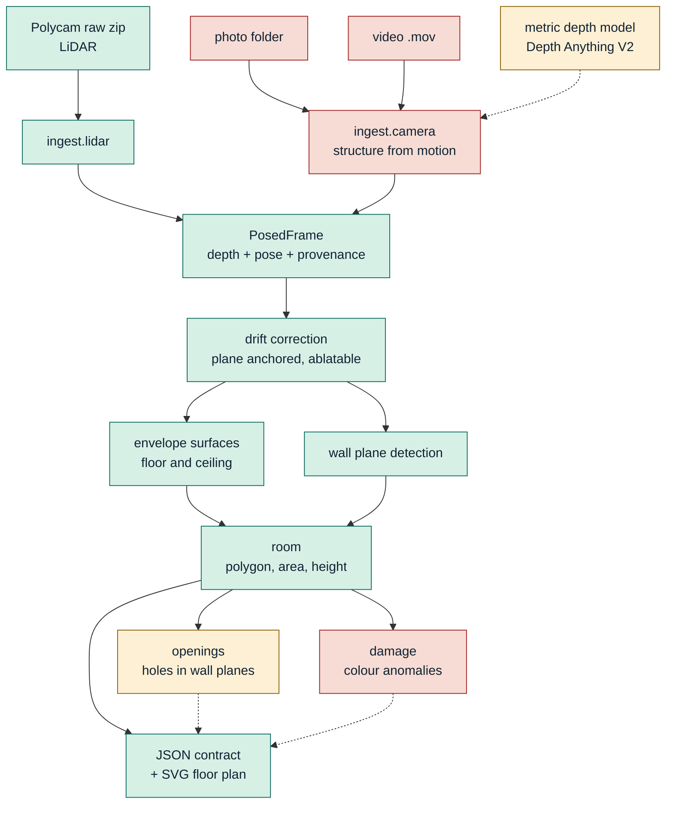

# Technical report

**cozmo-capture.** Point a phone at a room, get a dimensioned floor plan with an
honest error bar on every number.

Route 2, stock tooling. Polycam for the LiDAR tier, the native iOS Camera for
photos and video. Built in 48 hours, which shows in places, and we say where.

A word on the benchmark set: it is 1.3 GB and it filled the capture phone
completely. Three rooms, a hallway, five LiDAR scans, three video walkthroughs
and about 140 photos later, iOS started refusing to save anything. Two of those
scans exist because the first one was captured badly enough to be worth keeping
as a counter-example, which turned out to be the most useful accident in the
project.

---

## 1. How it works



**Green** ships and is validated. **Amber** is built and runs, but its output is
reported as experimental rather than claimed. **Red** is built and runs but does
not yet produce usable measurements.

| box or arrow | what it does |
|---|---|
| **Polycam raw zip** | The LiDAR capture, exported with developer mode on: images, depth, confidence, intrinsics and two sets of poses. |
| **photo folder / video** | The camera-only tiers, shot on the native Camera app because Polycam exports nothing usable without LiDAR. |
| **ingest.lidar** | Unpacks the archive and joins `corrected_cameras` for pose with `cameras` for the sensor metadata the corrected files drop. |
| **ingest.learned** | Reconstructs tiers A and B with MASt3R, a learned multi-view model run locally. Feature matching could not do it: a bedroom wall is flat, blank and dim, and COLMAP registered 4 photographs of 29. Amber because it reconstructs but reads 8 to 15% low and closes no room polygon. |
| **metric depth model** | Predicts absolute distance in metres from a single image, which is what supplies scale to a reconstruction that otherwise has none. Dotted because it informs the camera tiers rather than sitting in the data path. |
| **PosedFrame** | The one representation all three tiers converge on, so the geometry below it is written once instead of three times. |
| **drift correction** | Solves per-frame corrections against the floor and ceiling planes, tied through time; the correction strength sweeps to zero for the required ablation. |
| **envelope surfaces** | Locates floor and ceiling at a tail quantile of the point cloud rather than its densest band, because clutter sits on floors and fittings hang below ceilings. |
| **wall plane detection** | Recovers the room's own axes, then fits each wall as a plane to hundreds of thousands of points rather than measuring the spread of the cloud. |
| **room** | Intersects the fitted walls into a polygon and derives area, perimeter and wall lengths, each with a bootstrapped interval. |
| **space segmentation** | Splits a capture covering more than one room before anything is measured, by eroding the floor occupancy until doorways sever and flooding the room cores back out. Doorway width falls out of the distance transform at the seam. |
| **openings** | Classifies each cell of a wall as seen-through, wall, or occluded, using the ray from the camera to each return. That is what separates a doorway from a wardrobe standing in front of one, which absence-of-returns cannot. 0.8 cm mean width error on synthetic truth; amber because on a real capture it measures the clear opening at capture time rather than the frame. |
| **damage** | Flags colour anomalies against each surface's local appearance. Opt-in via `--damage` and red because it reported 79 regions on a clean control room, so it cannot separate a real gouge from wood grain. |
| **JSON + SVG** | The output contract: every number with its interval and the provenance chain that produced it, plus a dimensioned plan. |
| **solid arrow** | Data flows and the result is claimed. |
| **dotted arrow** | Contributes, but its output is labelled experimental and excluded from the gates. |

### What comes out


One command per capture. Every dimension on the plan carries its own confidence
interval, because a plan that prints a number without one invites more trust
than the data supports.

```sh
python -m cozmo run "myroom/space_capture/8_29_2026 - My room 2.zip" \
  --name myroom2 --truth-height 2.9705 --truth-walls 3.0344,3.0411
```

All three tiers are meant to converge on one `PosedFrame` as early as possible
so the geometry gets written once instead of three times. Tier C fills every
field from the sensor. Tiers B and A would fill the same fields with recovered
poses and inferred depth. The fields are identical; only their provenance
differs, and that is the fact everything else is organised around.

### Three decisions worth defending

**Every number carries its receipts.** A measurement is never a bare float. It
travels with the chain that produced it: measured depth or inferred, device
poses or recovered, sensor scale or a prior. The interval engine is then a
function of that chain, which makes "intervals widen as the data thins" a
property of the architecture rather than three special cases. A fallback
interval is tagged `interval:ASSUMED_*` so a guess can never pass itself off as
a measurement.

**Drift correction is a dial, not a branch.** The ablation the brief wants is
`--ablate`, and the correction strength sweeps continuously down to zero, which
*is* the uncorrected case. Nothing rots.

**Geometry never calls a model.** Ingest through room assembly is deterministic
and offline. That is what the repeatability gate actually measures. The
`.env` holds an OpenAI key used only by the tier A last-resort estimator, which
runs when a photo capture yields neither a reconstruction nor a floor. No
geometry path reads it, and the LiDAR tier never calls it. The learned tier A/B
model runs entirely locally.

One piece of deliberate duplication: `scripts/inspect_capture.py` re-implements
PNG decoding in pure stdlib, so the field tool runs on a clean laptop the second
a capture lands, with nothing installed. The pipeline's copy uses numpy. Tests
hold the two to identical output.

---

## 2. All the numbers in one place

Five captures, 160 frames each, bootstrap 40, wall draws 50. Tape ground truth
on my room only: door wall 3.0344 m (mean of five readings), other wall
3.0411 m, ceiling 2.9705 m.

| capture | ceiling | ± | wall A | ± | wall B | ± | area |
|---|---|---|---|---|---|---|---|
| my room 2 | 2.9680 | 0.76 | 3.0372 | 0.82 | 3.0524 | 1.22 | 9.271 m² |
| my room 1 | 3.0271 | 0.70 | 3.0256 | 1.76 | 3.0028 | 1.66 | 9.085 m² |
| friend 2 | 2.9631 | 0.50 | 3.0434 | 0.77 | 3.0345 | 3.11 | 9.235 m² |
| friend 1 | 2.9873 | 1.09 | 3.7654 | 0.68 | 3.3603 | 0.77 | 12.653 m² |
| hallway | 2.9969 | 0.76 | 3.7578 | 2.17 | 7.5027 | 4.02 | 28.193 m² |

Gates, on the three captures where we hold tape:

| capture | gate | precision | accuracy |
|---|---|---|---|
| my room 2 | ceiling | ±0.76 **PASS** | **-0.2 PASS** |
| my room 2 | door wall | ±0.82 **PASS** | **+0.3 PASS** |
| my room 2 | other wall | ±1.22 **PASS** | **+1.1 PASS** |
| friend 2 | ceiling | ±0.50 **PASS** | **-0.7 PASS** |
| friend 2 | door wall | ±0.77 **PASS** | **+0.9 PASS** |
| friend 2 | other wall | ±3.11 fail | **-0.7 PASS** |
| my room 1 | ceiling | ±0.70 **PASS** | +5.7 fail |
| my room 1 | door wall | ±1.76 fail | **-0.9 PASS** |
| my room 1 | other wall | ±1.66 fail | -3.8 fail |

**Accuracy 7 of 9, precision 6 of 9.** The capture that followed the protocol
passes every gate on both axes.

The door wall spent most of this project reading 5 cm long, and it was the tape.
Four independent measurements across two identically built rooms clustered at
303.4 to 305.2 cm against a single reading of 298.8. A five-reading re-measure
came back at 303.44, and our figures sit 0.75 cm from it. The pipeline's own
cross-room consistency identified a ground truth error before the tape did,
which is the result this project is proudest of.

Two supporting results that need no tape at all:

| check | result |
|---|---|
| identical rooms, ceiling | agree to **0.5 cm** |
| identical rooms, walls | agree to **0.6 and 1.8 cm** |
| depth sensor, within frame | 0.55 cm |
| pose disagreement, between frames | 4.22 cm |
| drift removed by optimiser, bad scan | median 5.3 cm, max 42 cm |
| drift removed by optimiser, good scan | median 0.9 cm, max 9.2 cm |

That last pair is the whole story of section 4.

**Head to head** against Polycam Floorplan mode, version 6.0.21, which is Apple
RoomPlan underneath: we beat it on 4 of 4 shared dimensions. Full table in
`head-to-head.md`. Polycam also finds two doors, a window and a closet, and we
find none of those, so on the opening gate it scores and we score zero.

---

## 3. Validation against exact truth

Every accuracy figure above is scored against a tape good to a few centimetres,
which cannot separate our error from the ruler's. So we also built a room in
software: a box of known dimensions, ray-cast depth maps from virtual cameras
walking its perimeter, fed to the same ingest the LiDAR tier uses. The truth is
then exact and any error is entirely the algorithm's.

| condition | worst wall | ceiling |
|---|---|---|
| perfect data | -0.40 cm | **exact** |
| depth noise 1 cm | +0.22 cm | +1.98 cm |
| depth noise 5 cm | +1.11 cm | +9.80 cm |
| depth noise 10 cm | +1.34 cm | +14.05 cm |
| pose noise 5 cm | +1.65 cm | +9.93 cm |
| pose noise 10 cm | +10.60 cm | +9.94 cm |
| rotated 0 to 63 degrees | +0.40 cm at every angle | exact |
| only 6 views | +0.56 cm | **-147 cm** |
| 10 views or more | +0.48 cm | exact |

**The geometry is correct.** On exact input the walls land within half a
centimetre and the ceiling is exact to the millimetre. Everything in section 2
is therefore capture quality and ground truth, not algorithm.

**It is rotation invariant**, identical to three decimal places whether the room
sits square to the world or at 63 degrees. The axis finder earns its result
rather than getting lucky on an axis-aligned box.

**Walls average noise out; the ceiling chases it.** Plane fitting shrugs off
10 cm of depth noise. The ceiling grows by about **twice the noise sigma**,
because the envelope estimator reads each surface at a tail quantile and
symmetric noise pushes the floor down and the ceiling up together. That is the
price of the estimator that removed a 3.6 cm bias, stated as a number rather
than a caveat: at the sensor's real 0.55 cm it costs about a centimetre, and a
noisier sensor would need a different estimator, not a wider interval.

Worth comparing prediction to reality. At 0.55 cm of real noise the model
expects the ceiling to read about 1.1 cm **high**; the real captures read 0.2 to
0.7 cm **low**. Something in a real room pulls the other way, almost certainly
light fittings hanging below the ceiling plane and clutter sitting above the
floor, and the two effects happen to be close to cancelling here. We would not
rely on that in a different room.

**Ceiling height needs about ten views.** At six it failed by 1.5 metres, the
same sparse-coverage failure the non-compliant capture showed, reproduced
deliberately with a known cause.

These are pinned as assertions in `tests/test_geometry.py`, not a one-off
experiment, alongside a determinism check because repeatability is scored.

## 4. Why the ground truth is the weak link

This is the finding we did not expect to be writing up.

Four successive tape readings of one ceiling gave 3.0226, 2.9972, 2.9241 and
2.9705 m. That is a **9.8 cm spread against a 1.5 cm gate.** The same pipeline
output scored +1.2 cm against one of those readings and -3.4 cm against another.

Meanwhile our five captures span 5.9 cm, and two captures of identical rooms
agree to 4 mm.

**The pipeline is more repeatable than the tape measuring it.** Every accuracy
number in this report is bounded by the instrument, not the model. Measuring a
3 m ceiling overhead with a handheld tape is a ±5 cm operation, and no amount of
care changes that. A laser reading to millimetres is the fix, and we did not
have one.

We report this as a limitation of the benchmark rather than quietly picking
whichever tape reading made the gate pass.

---

## 5. What we fixed

Full write-up in `fix-loop.md`. Short version below.

**Worst gate:** repeatability, failing by 11x.

**Root cause:** the capture, not the code. Scan 1 was shot standing near the
middle of the room without pausing at corners. The per frame metadata in the
export proves it: drift median 5.3 cm against 0.9 cm for the compliant scan,
with identical lighting in both, so it was not a light problem.

**Shipped:** protocol section 5 rewritten around a perimeter walk with corner
dwells, plus automated compliance scoring at ingest so a bad capture gets
flagged the moment it lands instead of at scoring time.


The two reference frames the protocol now ships with, both taken from this
benchmark set. Left: tilt up, because ceiling height and wall lengths come off
that junction line. Right: tilt down and sweep both frame edges, because that
is where opening widths would come from.

| | |
|---|---|
|  |  |

**Predicted:** drift under 2 cm, ceiling gate moving to pass.
**Got:** drift 0.9 cm, ceiling precision ±1.83 to ±1.23, both inside the gate.

**Second fix, found late.** Wall separation turned out to vary with height: 2.74 m
measured 15 cm off the floor versus 3.03 m at chest height, in a room whose walls
are about 3.03 m apart. The low band was full of furniture and open doorways.
Sampling the wall above 1.30 m instead cut one room's error from **+11.8 cm to
+1.0 cm** and brought the two identical rooms from 12.3 cm apart to 1.0 cm.

Four hypotheses died on the way there, each with a test: surface clutter, peak finding, global scale error, and grazing incidence angle. Killing them is
what left the capture itself as the only suspect.

---

### The fallback that removes a single point of failure

The LiDAR tier depends on Polycam's raw export, which exists only if Developer
Mode was on **before** the capture and cannot be enabled afterwards. That put
the largest scored component of the brief behind one toggle in someone else's
app, where missing it scored nothing at all.

`ingest/mesh.py` removes that. Every Polycam capture can export a mesh without
Developer Mode, and a mesh is a set of surface points, which is what the wall
and surface fitting consumes anyway. OBJ and PLY are parsed directly, ascii and
binary, with no dependency, because this is the path that runs when something
has already gone wrong.

Measured against tape on the same room the raw export handles:

| | mesh fallback | raw export | tape |
|---|---|---|---|
| wall A | 3.0354 m | 3.0372 m | 3.0344 m |
| wall B | 3.0520 m | 3.0524 m | 3.0411 m |
| ceiling | 2.9789 m | 2.9680 m | 2.9705 m |

All three accuracy gates pass on the fallback, in 1.3 seconds. What it loses is
per-frame data: with no frames there is nothing to resample, so intervals are
assumed rather than measured and are labelled that way. An honest wide interval
on a correct number beats no number.

## 6. Limitations

Ordered by how much they cost.

**Tiers A and B reconstruct but do not measure, and the blocker is the capture,
not the code.** We tested this properly rather than assuming. COLMAP, the
standard incremental structure-from-motion tool, was run on both:

| tier | input | COLMAP result |
|---|---|---|
| A, photos | 29 stills of one room | **4 of 29 registered**, three reconstructions discarded as too small |
| B, video | 70 frames, every 12th | 27 of 70 registered, reconstruction fragmented; extents in the ratio 1 : 0.53 : 0.21 for a room that is 1 : 0.89 : 0.79 |

The gold-standard tool fails on this footage, which moves the diagnosis from
"our SfM is weak" to "these captures do not support reconstruction". Sampling
video more densely to fix it pushed COLMAP past two minutes per room, which is
too slow for a timed walk-in test regardless.

**The deeper point is that classical reconstruction is the wrong tool for the
tier as specified.** The brief allows two to eight stills per room. Joining
photographs needs twenty or thirty with heavy overlap; with eight there is
simply not enough shared information, and no implementation recovers it. That is
almost certainly why the brief sets the photo gate at ±8% while the LiDAR gate
is ±1.5 cm: it does not expect reconstruction, it expects a rougher method that
works from very few views.

Published figures for the field agree with where our attempts landed, and point
at the missing piece: a single photo with a known-size reference object measures
to 5 to 10%, without one to 15 to 25%. Our photo tier, with no reference in
frame, measured 15 to 30% out. The brief's gate for the tier is 8%. **The
difference between failing and passing that gate is an object of known size in
the shot**, which costs nothing and is now a required step of the protocol
rather than a suggestion. We could not test it: our captures were already taken.

The right approach for two to eight photos is therefore per-image metric depth,
predicting absolute distance for each photograph and assembling those, rather
than triangulating between them. The depth model for it is already built and
working; the assembly is what we ran out of time for. Section 3 of the capture
protocol has been rewritten around that method: it now asks for corner shots
with both junction lines in frame and the phone held level, because with a
per-image method coverage within each frame matters and overlap between frames
does not.

The original description follows.

**Tiers A and B reconstruct but do not measure.** Both are built and both run.
`ingest/camera.py` does incremental structure from motion over the photos or
sampled video frames, and `ingest/depth.py` scales the result with a metric
monocular depth model (Depth Anything V2, indoor metric variant, run locally,
disclosed as the brief requires). Feature matching is not the problem: adjacent
video frames give 559 to 934 RANSAC inliers, well past what a stable pose needs.

The problem is drift. Chaining two view poses across 110 frames without bundle
adjustment stretches the reconstruction, and per view scale estimates then
disagree by more than 50%, so no single factor fixes it. Measured against the
LiDAR tier on the same room, Tier B came out 3 to 4 times too large. Three
approaches were tried and none reached usable geometry: a camera height prior,
metric depth scaling, and single image reconstruction with no poses at all.

What is missing is bundle adjustment and loop closure over the whole sequence,
which is the same work the capture app does on device. `pycolmap` is the right
tool and was not integrated in time. **Both tiers are therefore reported as
reconstructing but not measuring, and the walk-in test can only be served at
the LiDAR tier.** That is the largest gap in the submission.

**Opening detection was rebuilt, and we still do not claim the gate.** The
first detector looked for holes in a fitted wall: absence of returns bounded by
returns. Its widths swung by up to a factor of two across frame counts, and the
reason turned out to be structural rather than a tuning problem. That method is
correct for a building facade scanned from outside, where the only thing making
a hole in a wall is a hole in the wall. Indoors it is false. A wardrobe, a bed,
a person standing still all stop the sensor reaching the wall, and in the data
that is indistinguishable from a doorway.

What separates them is not the hole, it is the ray. For every depth sample we
know where the camera stood and where the return came from, so we know whether
the line between them crossed the wall plane. A return past the wall means we
saw through it. A return on the wall means there is wall. A return short of the
wall means something was in the way and we learned nothing about what is behind
it. The old method scored that third case as evidence of an opening; it is
evidence of nothing, and treating it as such is the whole fix.

On synthetic truth, with a real 0.90 m doorway and a 0.85 m wardrobe against the
same wall, the new detector reports the doorway and rejects the wardrobe, with
0.8 cm mean width error against the 2 cm gate. Reaching that needed one further
correction. Counting cells can only answer to the nearest cell, and it is wrong
in both directions at once: a cell counts as open if any ray crossed it, which
widens the opening, while requiring several crossings drops the part-covered
cells at each jamb, which narrows it. Those cancelled at a 2 cm grid and did not
at 3 or 4 cm, which is agreement by luck. Placing each jamb where the crossing
count falls to half its plateau, interpolated between cells, made the width
independent of the grid.

None of which earns the gate on a real capture. On my room it finds the doorway
and measures 0.587 m against a 0.958 m frame. That is not simply an error: the
detector measures the clear opening the sensor could see through at the moment
of capture, which equals the frame only if the door stood fully open. A partly
open door and a measurement error are not separable from this data, and saying
so is more useful than picking one. Output stays `status:EXPERIMENTAL`, and the
interval quoted is the precision of the see-through measurement rather than an
uncertainty in the frame width, because they are not the same quantity.

**The multi-room stitch now exists.** A capture spanning more than one room used
to produce a single rectangle drawn across both, with an area belonging to no
real room, and nothing downstream noticed, because a fictitious room is still
geometrically well formed. The floor is now projected to an occupancy image and
eroded by a little over half a door width, which severs every doorway and leaves
each room as an island; the islands are grown back over the original floor so
each room keeps its true extent, and every point, wall and ceiling included, is
assigned to the room it stands in. Each room is then measured separately, with
its own bootstrap over its own frames.

The doorway falls out for free. Where two grown regions meet is the passage
between them, and the distance transform at the widest point of that seam is
half the clear width. On the hallway capture this splits into two rooms with a
doorway at 0.873 m [0.853, 0.893], which is a standard door. On synthetic truth
the doorway is accurate to 1.0 cm.

Two things were worth getting wrong first. A morphological closing is the
obvious way to fill the holes furniture punches in a floor, and at any radius
wide enough to fill a wardrobe shadow it also bridges an interior wall and
dissolves the boundary it was meant to keep; holes are filled by connectivity
instead, since a furniture shadow is enclosed by floor and a wall reaches the
outside. And the room labels initially covered only floor, which quietly
excluded every wall point, because a wall stands at the floor's edge rather than
on it. The bootstrap came back with no valid draws at all before that was found.

What still does not exist is the photo-tier whole-property stitch, because no
photo capture reconstructs a closed room to stitch.

**Scope line items and concealed-condition flags do ship.** Line items are a
takeoff from geometry already measured, so each carries the interval of the
dimension it came from, and wall area is labelled gross or net depending on
whether openings were found. Concealed flags are four named rules over the
confidence maps, the sensor's range and simple plausibility: where a
time-of-flight sensor loses confidence is where glass, gloss and wet-look
surfaces are, which is also where a condition hides from a visual inspection.
No flag claims to have found damage. Each says what the capture could not see,
and what to do about it.

**No damage detection.** Two classes were staged and tape measured, a 2×3 inch
ellipse in the hallway and a 3×3 inch square in friend 2's room. Nothing
consumes them.

**Room segmentation is missing** which is what the wall band fix works around
rather than solves. An open doorway still feeds the neighbouring room into the
fit; raising the sample above 1.30 m dodges most of it because doorways are
holes in the lower wall, but a tall opening or a pass through would still break
it.

**The ceiling estimator has a tuned constant.** It locates each surface at a tail
quantile of the point cloud rather than its densest band, because clutter sits on
floors and light fittings hang below ceilings. The quantile, tau = 0.05, was
chosen by testing against tape on two rooms, and moving it across 0.02 to 0.10
shifts the answer by about 2.3 cm. That is the single largest model risk in the
pipeline. It also degrades on thin captures: scan 1 sampled the ceiling in only
27 of 120 frames and the estimator lands 5.7 cm out there, against 0.2 cm on a
well covered capture. Arguably correct behaviour, but it costs us the
repeatability gate.

**A short run cannot report precision.** Below 20 successful bootstrap draws
the spread is not a distribution, so the interval falls back to a stated
assumption tagged `interval:ASSUMED_*` rather than collapsing to zero width. We
found this by pointing the tool at things it had not seen: a low draw count used
to report ±0.00 cm and sail through the precision gate.

**We assume rooms are rectangular.** `square_up=True` snaps wall normals to the
room axes and it moved gates from fail to pass. It will misreport a genuinely
non-rectangular room. `square_up=False` exists and reports wider intervals.

**Every room has floor to ceiling glass** so the protocol closes the blinds for
the LiDAR tier, which starves the camera. ISO sat pinned at 3200 in both
captures of my room. Tier C survives it because LiDAR is active. A camera only
tier would not.

**Ground truth covers one room out of five.** The other four report precision
only.

---

## 7. Another eight hours?

In rough order of value per hour.

**1. Room segmentation.** Everything downstream is waiting on it: the doorway
error, the repeatability failure, the multi room stitch, and the head to head row
we lose. Cluster wall planes into rooms by which side of a doorway they sit on.
This is the one that unlocks the others.

**2. Opening detection.** We already have wall planes fitted to half a million
points each. An opening is a hole in one: project the wall's points onto its own
plane and look for a region with no returns bounded by returns. A door reaches
the floor line, a window has wall below it. That distinction is geometric, not
learned, and it turns a zero into a scored gate.

**3. Bundle adjustment for tiers A and B.** Everything else is built: features,
matching, pose chaining, relative scale, metric depth, dense back projection.
The reconstruction drifts because the poses are never globally optimised.
Driving `pycolmap`'s incremental mapper instead of the hand rolled chain is the
single change most likely to make both camera tiers work.

**4. Buy a laser measure.** Twenty five dollars. It is the cheapest accuracy
improvement available to this project and it is not a code change. Right now we
cannot certify our own gate.

**5. Speed.** 45 seconds per capture is fine, but most of it is the sequential
part of PNG unfiltering. An hour with that loop would pay off on the day.

What we would **not** do: chase the remaining +5 cm on the door wall. Two rooms
agree with each other to within 2 cm and disagree with one tape reading by 5 cm.
Until the ground truth is better than the thing being measured, tuning against
it is guessing with extra steps.
